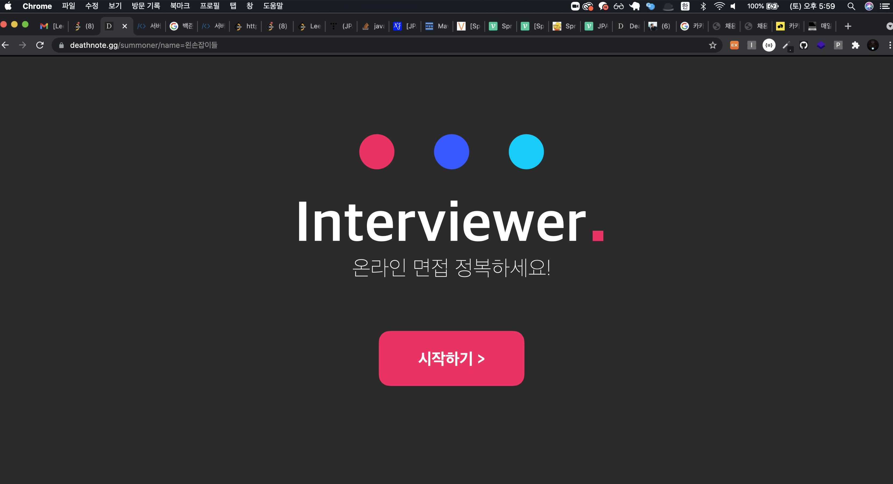
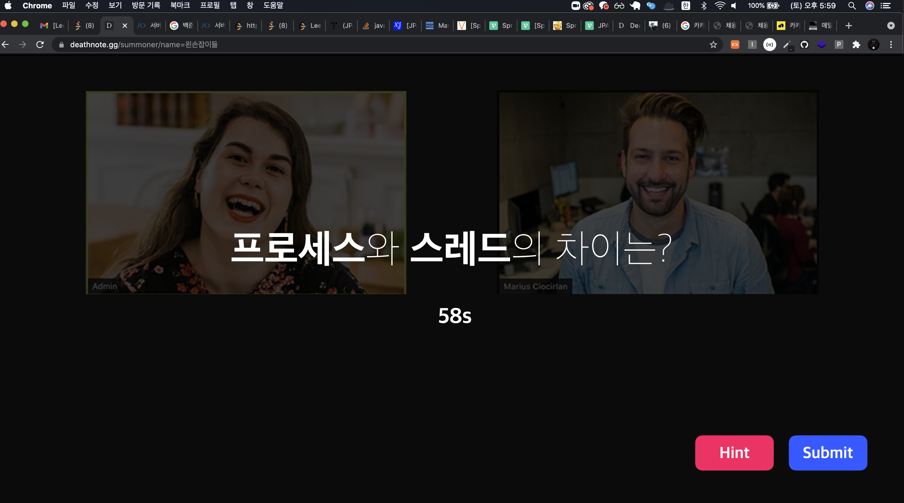

# interviewer-api-server

<h3>

💻 interviewer 서비스 API server

</h3>

<h4>

메인 화면

</h4> 

 

## 😢 Problem

온라인 면접을 준비함에 있어서, 온라인 면접을 대비할 수 있게 도와줄 수 있는 서비스의 필요성을 
느끼게 되었습니다. 
제가 필요하기도 하고, 다른 사람들도 사용했으면 좋겠다는 생각으로 개발을 진행 중에 있습니다.

<h4>

문제 풀이 화면 ( 디자인 진행 중 )

</h4> 

## 🔨 Dev stack

- Spring Boot
- Spring MVC
- Spring JPA
- AWS EC2
- AWS RDS

  

## Commit Convention

- **feat**: A new feature
- **fix**: A bug fix
- **docs**: Changes to documentation
- **style**: Formatting, missing semi colons, etc; no code change
- **refactor**: Refactoring production code
- **test**: Adding tests, refactoring test; no production code change
- **chore**: Updating build tasks, package manager configs, etc; no production code change

  

## Reference

- **Commit Convention** 
  https://udacity.github.io/git-styleguide/

